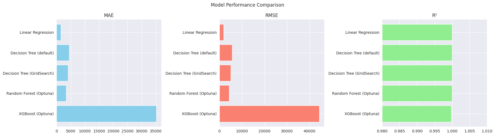

# 🏠 Paris Housing Price Prediction


This project focuses on predicting housing prices in Paris using various regression models.  
The goal is to compare the performance of different algorithms and build a robust pipeline for price estimation based on real-world data.

---

## 📋 Table of Contents

1. [About](#about)
2. [Dataset](#dataset)
3. [Data Preprocessing](#data-preprocessing)
4. [Installation](#installation)
5. [Usage](#usage)
6. [Web app - Model testing](#web-app---model-testing)
7. [Project Structure](#project-structure)
8. [Models Used](#models-used)
9. [Evaluation Metrics](#evaluation-metrics)
10. [Results](#results)
11. [Visualizations](#visualizations)
12. [Packages / Environment](#packages--environment)
13. [Contributing](#contributing)
14. [License](#license)
15. [Conclusion](#conclusion)
16. [Contact](#contact)

---

## About

The Paris Housing Price Prediction project aims to build and evaluate several regression models to predict housing prices based on various features such as size, location, and property characteristics.  
This serves as a practical case study for regression tasks and model comparison using real estate data.

---

## Dataset

The dataset used in this project is sourced from [Kaggle - Paris Housing Price Prediction](https://www.kaggle.com/datasets/mssmartypants/paris-housing-price-prediction).  
It contains approximately 8,000 entries with the following features:

- Square meters of living area (`squareMeters`)
- Number of rooms (`numberOfRooms`)
- Number of bedrooms (`numberOfBedrooms`)
- Number of floors (`floors`)
- Latitude and longitude (geographical coordinates)
- Lot area (`lotArea`)
- Additional features such as presence of a pool, garage, basement, year built, and more.
---

## Data Preprocessing

The dataset was already clean, with no missing values or need for transformations.  
This allowed us to directly use the features for modeling without additional preprocessing steps.

---

## Installation

To run this project locally, follow the steps below:

1. Clone the repository:

    ```bash
    git clone https://github.com/toncompte/paris-housing.git
    cd paris-housing
    ```

2. Create and activate a Python virtual environment:

    ```bash
    python -m venv venv
    source venv/bin/activate      # Linux/macOS
    venv\Scripts\activate         # Windows
    ```

3. Install the required dependencies:

    ```bash
    pip install -r requirements.txt
    ```

---

## Usage

The project is structured as a Jupyter notebook for interactive exploration and model training:

   ```bash
     jupyter notebook notebooks/paris_housing_analysis.ipynb
   ```

## Web App - Model Testing

An interactive web application is available to test predictions from the different regression models developed in this project.

This Streamlit app allows you to:
- Visualize the distribution of input features and target variable
- Compare the performance of models side-by-side
- Input custom data to test predictions from Linear Regression, Decision Tree, Random Forest, and XGBoost models


You can access the app online here:  
[https://paris-housing.streamlit.app/](https://paris-housing.streamlit.app/)

---

## Project Structure

```
paris-housing/
├── data
│   └── paris_housing.csv
├── LICENSE
├── notebooks
│   └── paris_housing_analysis.ipynb
├── outputs
│   ├── metrics_outputs
│   └── models
├── README.md
├── requirements.txt
├── src
│   ├── distribution.py
│   ├── evaluate.py
│   └── save.py
├── streamlit_app
│   └── app.py
```

## Models Used

- **Linear Regression:** baseline model for simple linear relationships
- **Decision Tree Regressor:** non-linear model with interpretable tree structure
- **Random Forest Regressor:** ensemble of decision trees to reduce overfitting
- **XGBoost Regressor:** gradient boosting model known for high performance

## Evaluation Metrics

Models are evaluated with common regression metrics:

- **RMSE (Root Mean Squared Error):** measures average magnitude of errors
- **MAE (Mean Absolute Error):** average absolute differences between predictions and actual values
- **R² Score (Coefficient of Determination):** proportion of variance explained by the model

These metrics provide complementary views on model performance.

---
## Results


| Model                    | MAE       | RMSE     | R²   |
|--------------------------|-----------|----------|------|
| Linear Regression        | 1,510.03  | 1,922.42 | 1.00 |
| Decision Tree (default)  | 4,494.98  | 5,704.07 | 1.00 |
| Decision Tree (GridSearch)| 4,040.20  | 5,097.64 | 1.00 |
| Random Forest (Optuna)   | 3344.94  | 4356.93 | 1.00 |
| XGBoost (Optuna)         | 35,212.45 | 44319.10| 1.00 |
---

## Visualizations

The project includes visualizations such as:

- Feature distributions and correlations
- Predicted vs. actual prices scatter plots
- Residuals distribution histograms

These visualizations help interpret model behavior and identify improvement areas.

Below is a comparison of model performance:



---
## Packages / Environment

This project uses the following main packages and versions:

- Python 3.10
- pandas 2.0.2
- numpy 1.24.4
- scikit-learn 1.3.0
- xgboost 3.0.2
- optuna 3.1.0
- matplotlib 3.7.1
- seaborn 0.12.2
- tqdm 4.65.0

---

## Contributing

Contributions are welcome!  
If you want to improve this project, please follow these steps:

1. Fork the repository.
2. Create a new branch (`git checkout -b feature/your-feature`).
3. Commit your changes (`git commit -m 'Add some feature'`).
4. Push to the branch (`git push origin feature/your-feature`).
5. Open a Pull Request.

Please make sure your code follows the existing style and passes any tests.

---

## License

This project is licensed under the MIT License.  
See the [LICENSE](./LICENSE) file for details.

---

## Conclusion

Linear Regression performed very well due to the presence of a dominant feature strongly correlated with the target variable.  
Tree-based models like Decision Trees and Random Forests showed competitive results, especially after hyperparameter tuning with Optuna.  
Future improvements could include testing regularization methods such as LASSO or Ridge regression, and exploring deep learning approaches.

---

## Contact

If you have any questions or want to get in touch, feel free to contact me:  
**Marc Djole**  
Email: [djolemarc@cy-tech.fr](mailto:djolemarc@cy-tech.fr)  
GitHub: [https://github.com/lategardener](https://github.com/lategardener)

---
